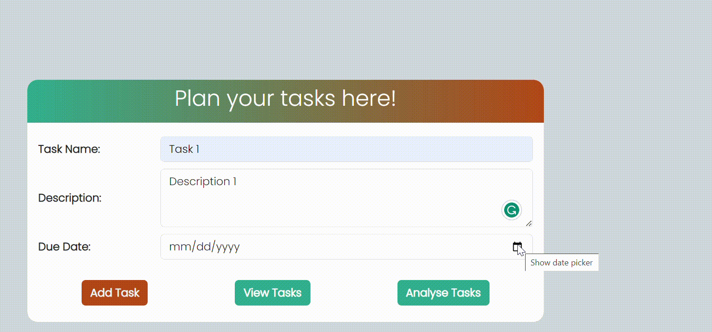
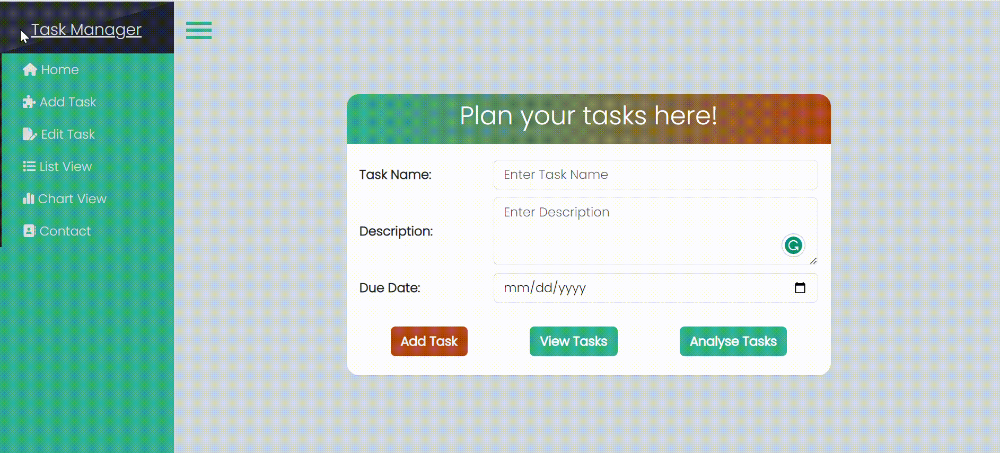
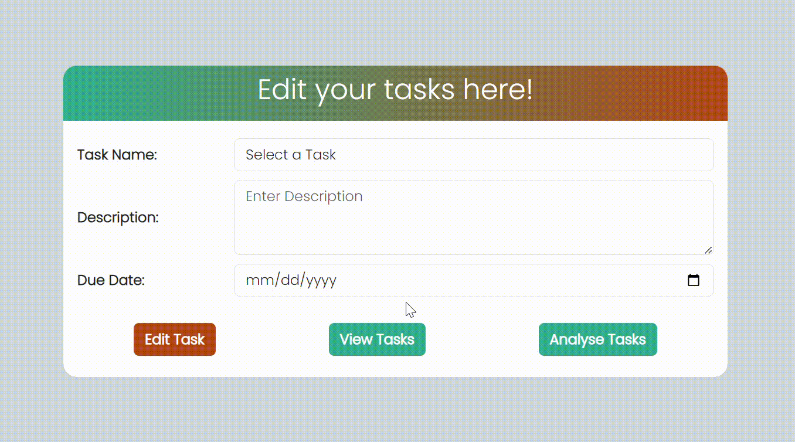
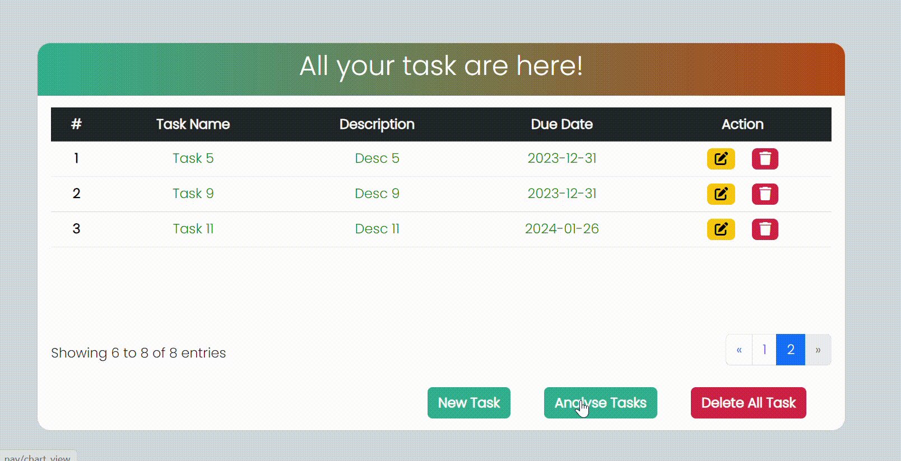
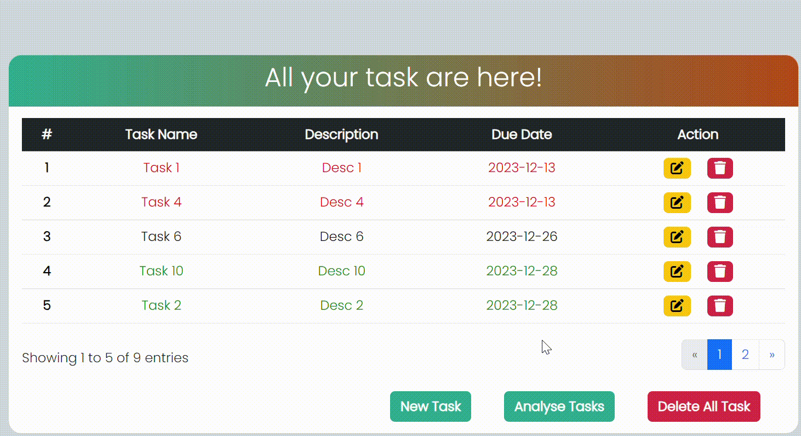

# Project Title
### Task Manager:- 
This is a web application intended for generating, observing, and analyzing your tasks.

## Demo link:
Access my site at [https://hritesh1728.github.io/task_manager/](https://hritesh1728.github.io/task_manager/)

## Table of Content:

- [About The App](#about-the-app)
- [How does it works](#how-does-it-works)
- [Technologies](#technologies)
- [Setup](#setup)
- [Credits](#credits)

## About The App
Task Manager is a robust web application meticulously crafted using [Angular CLI](https://github.com/angular/angular-cli) *(version 17.0.8.)* to meet your task management needs. 

This dynamic platform offers a range of functionalities, allowing users to seamlessly create, view, and analyze their tasks.

With an intuitive user interface, Task Manager provides an efficient and organized way to handle your tasks. 

Hence, it enhance your productivity with and helps to conquer your tasks with ease.

## How does it works!
1. Click the **Get Started!** button on the homepage.

2. Add new task

3. Edit your task if you their are changes in plan

4. View your task in a list of table type

5. Analyse your weekly commitments

6. Delete your task or tasks

## Technologies
I used `Angular`, `Angular Bootstrap`, `ng-apexcharts`, `bootstrap`,`HTML5`, `CSS3`,`JavaScript`,`Browser Properties`, `Font Awesome`,`Google fonts` and many more.

## Setup
- download or clone the repository
- run `npm install`
- then run `ng serve` for a dev server. Navigate to `http://localhost:4200/`. The application will automatically reload if you change any of the source files. 

## Credits
- *I would like to express my gratitude to **`Biva Analytics`** for providing me with the opportunity to work on this project. Their insightful assignment has served as the driving force behind the purposeful development of this project.*

